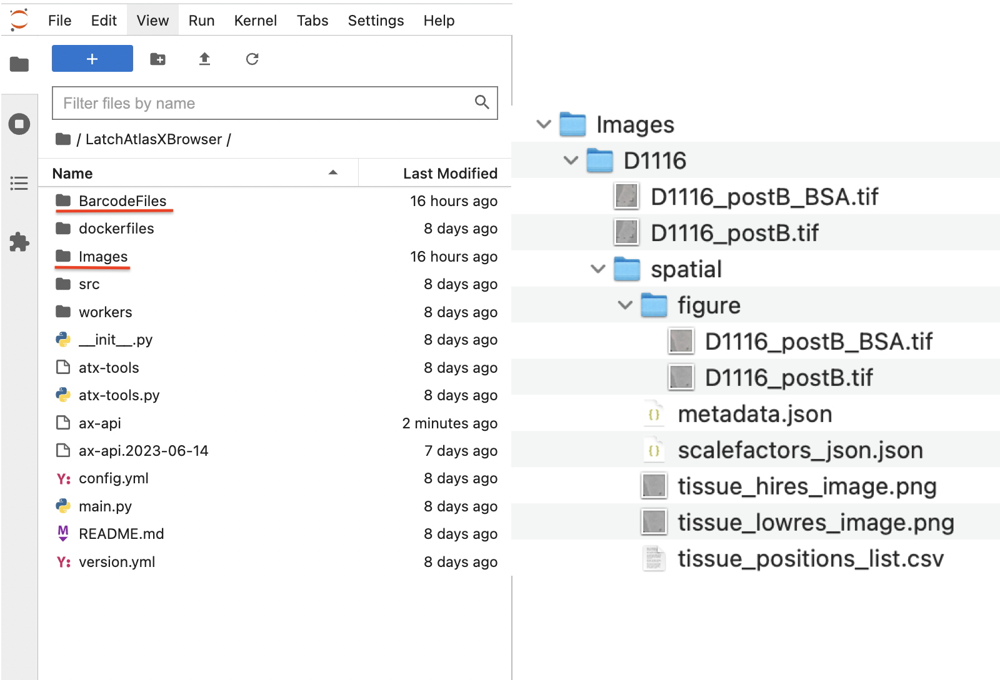
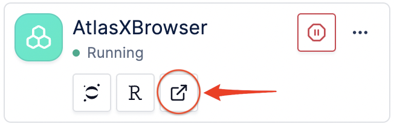
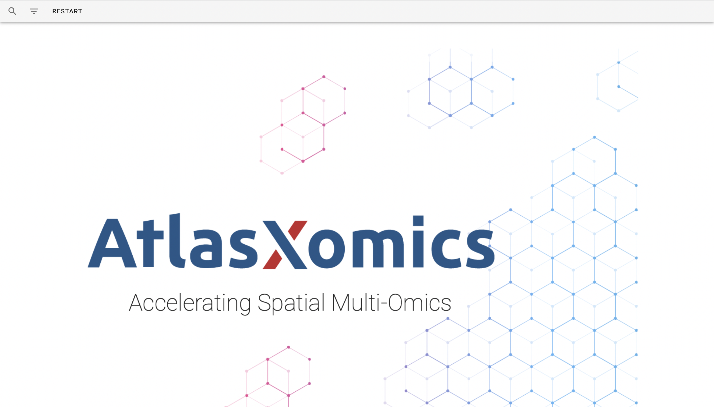

Running on Latch
__________________________________

Latch is a biomedical data analysis company that provides a cloud-based platform for researchers and organizations to store, analyze, and interpret large-scale genomic and other biomedical datasets. The company's platform enables users to access and analyze complex data sets, collaborate with other researchers, and leverage various bioinformatics tools and workflows. AtlasXBrowser will be running on a Latch **Pod/App**, which is a standalone Amazon ec2 instance.

Opening App
############
During this step, one must click the play/stop button on the specified app to turn it on and off. 

1. Navigate to the highlighted button to access jupyter notebook which will be used to run commands and prep the application.

.. figure:: /images/clickJupyter.png

2. Once Jupyter Notebook is accessible select the **Terminal** button.

.. figure:: /images/clickTerminal.png

3. Then type the command **abrowser** into the terminal and hit enter. Only have to run this comand when the app is initially turned on. The application will begin to load and the mesage **...done** will appear in the terminal

.. figure:: /images/abrowsercommand.png

The Images folder is where the DBiT run images will be stored, and where the spatial folder will be placed after it is generated. This is the formatting for the folder. There is the ability to drag and drop files to this folder in the app.

*Note:*

* The path to this folder is /root/LatchAtlasXBrowser

* Only the postB_BSA image is necessary for software to work.

    There is one more location where images can be stored, inside the data directory in Latch. One can upload files and folders.

    .. figure:: images/dataLatch.png

4. Navigate back to the **Applications** directory in Latch and open the Custom App.

Once the spatial is folder is generated it will be placed in both locations that store data. If you want to change the spatial folder, use the same steps to start the application and if a spatial folder is found in either of those locations you will be promoted with two choices. **REPROCESS** or **UPDATE**

* REPROCESS will generate a new folder.

* UPDATE will allow you to change which tixels are off and on.

Click below for a tutorial video on YouTube

